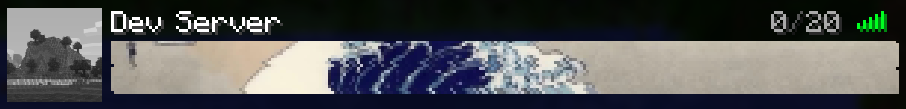

# ImageMOTD

This is a two part repository for making image based MOTDs for your Minecraft server. There is a plugin that renders a list of sprites from a text file in the MOTD slot and a bun script that turns an image into that list of sprites.

Ideally this would all be contained in the plugin but I don't really want to do that, if anyone else wants to help with that please contribute.

This project is made as a "prove I can do it" thing more than an actual product I am persuing so I may or may not update this in the future.

## Plugin
The plugin is a standard MC plugin that renders sprites in the MOTD, it fetches the sprites for the MOTD from a txt file located in the plugins images folder.

## Image Maker
This is a series of bun scripts that you can run with `bun run index.ts --image image.png` to generate the txt file to put in the plugin. You need to update the .env with your api key for mineskin. It should scale depending on your Mineskin plan. Images should be 264x16.

## How does it work?

This plugin works by rendering a series of player heads loaded with the skins generated by Mineskin. I then set the MOTD to render with a -1 shadow which causes them to glow and display the real colors. There is now a way to control the shadow so the middle line between the two rows will render again at a slight offset.