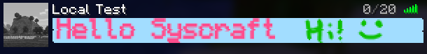

# ImageMOTD

This is a plugin that lets you use an image as your MOTD. It uses the new sprite system added in 1.21.9 to render playerheads as the MOTD that have been assigned the textures to make up the image. Right now this only works with manually signed heads, support for just using an actual image file will be coming soon.

